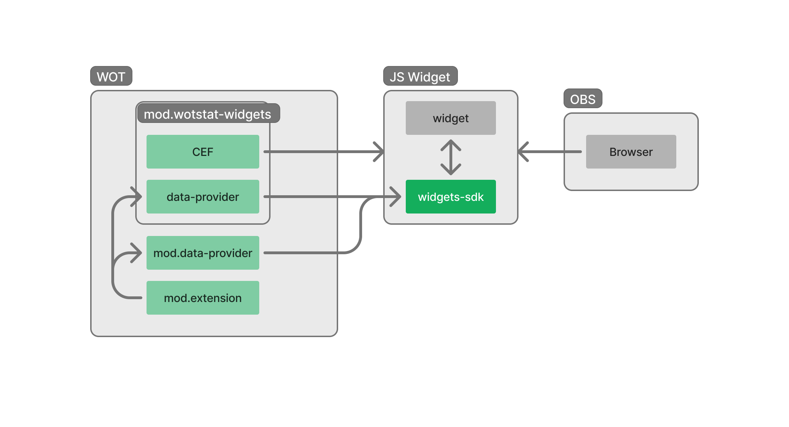

# wotstat-widget-sdk
JavaScript библиотека для создания веб-виджетов и связи с `wotstat-data-provider` модом.



> [!IMPORTANT]
> Для работы SDK необходим мод [wotstat-data-provider](https://github.com/WOT-STAT/data-provider) или [wotstat-widgets](https://github.com/WOT-STAT/wotstat-widgets)

## Установка

С помощью npm:
```bash
npm i wotstat-widget-sdk
```

С помощью CDN:
```html
<script src="https://cdn.jsdelivr.net/npm/wotstat-widget-sdk/dist/wotstat-widget-sdk.js"></script>
```

## Использование

### DataProvider
Для связи с модом `wotstat-data-provider` SDK предоставляет объект `data`, внутри него иерархическая структура данных, у которой на определённом уровне встречается `State` (состояние) или `Trigger` (событие).

Часть `data`:
```ts
{
  hangar: {
    vehicle: {
      info: {
        value: State<...>
      }
    }
  },
  battle: {
    onBattleResult: Trigger<...>
  }
}
```

#### Рабочий пример
```js
import { WidgetSDK } from 'wotstat-widget-sdk'

// инициализация SDK
const sdk = new WidgetSDK()

// подписка на изменение статуса (ожидание открытия игры)
sdk.onStatusChange(status => console.log(status))

// получение текущего танка
const currentTank = sdk.data.hangar.vehicle.info.value
console.log('Current tank:', currentTank)

// подписка на изменение танка
sdk.data.hangar.vehicle.info.watch((newValue, oldValue) => {
  console.log('New tank:', newValue)
  console.log('Old tank:', oldValue)
})

// подписка на получение результата боя
sdk.data.battle.onBattleResult.watch(result => {
  console.log('Battle result:', result)
})
```

Более подробная информация в [документации](./docs/api.md).

### Стили

SDK предоставляет некоторые стандартные стили для удобства разработки виджетов. Доступ к стилям можно получить двумя способами:
- Через использование длинных классов (например, `wotstat-background`, `wotstat-accent`)
- Через использование родительского класса `widgets-sdk-styles` и дочерних коротких классов (например, `background`, `accent`)

Стили будут доступны после инициализации SDK.

> [!NOTE]
> Цвета `background` и `accent` автоматически изменяются в зависимости от query параметров в URL.
>  `background` и `accent` соответственно, например: `?background=292929&accent=4ee100`. Поддерживается прозрачность.


#### Пример
```html
<body>
  <div class="widgets-sdk-styles">
    <div class="background">
      <h1 class="accent">Widget</h1>
    </div>
  </div>

  <div class="wotstat-background">
    <h1 class="wotstat-accent">Widget</h1>
  </div>
</body>
```

Более подробная информация в [документации о стилях](./docs/styles.md).

### WidgetMetaTags

`WidgetMetaTags` - содержит инструменты для работы с мета-тегами виджетов.  
На данный момент существует только один тег – `wotstat-widget:auto-height` для автоматического расчёта высоты виджета в моде `wotstat-widgets`.

```js
import { WidgetMetaTags } from 'wotstat-widget-sdk'

// включить автоматическое изменение высоты виджета, если оно было отключено
WidgetMetaTags.enableAutoHeight()

// отключить автоматическое изменение высоты виджета, если оно было включено
WidgetMetaTags.disableAutoHeight()

```

## Debug Виджет
Есть специальный `debug` виджет, который отображает почти все возможные данные SDK.

